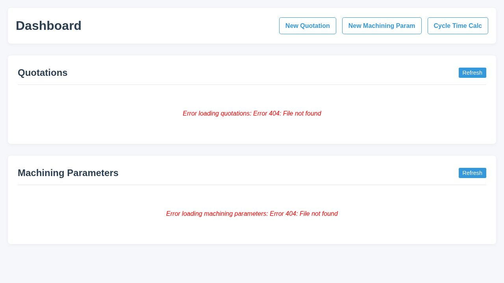
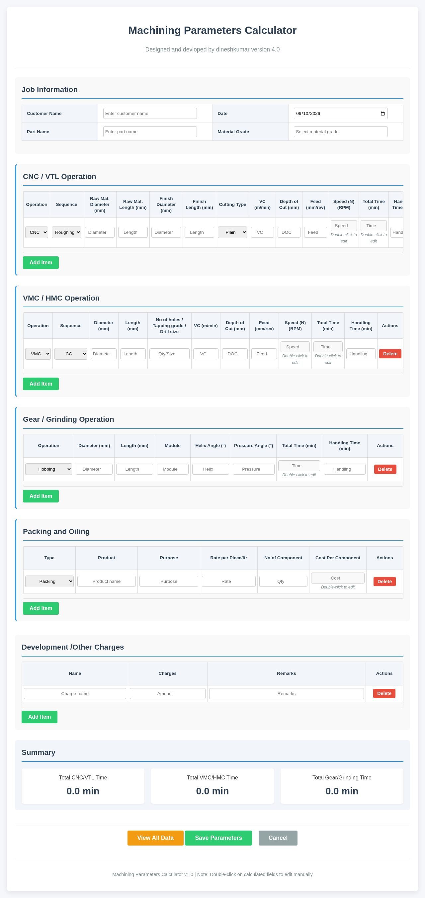
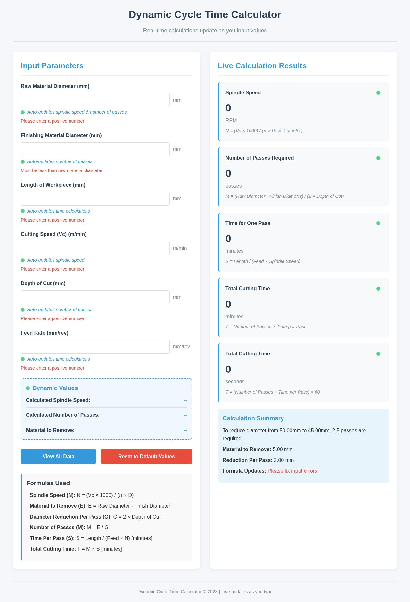
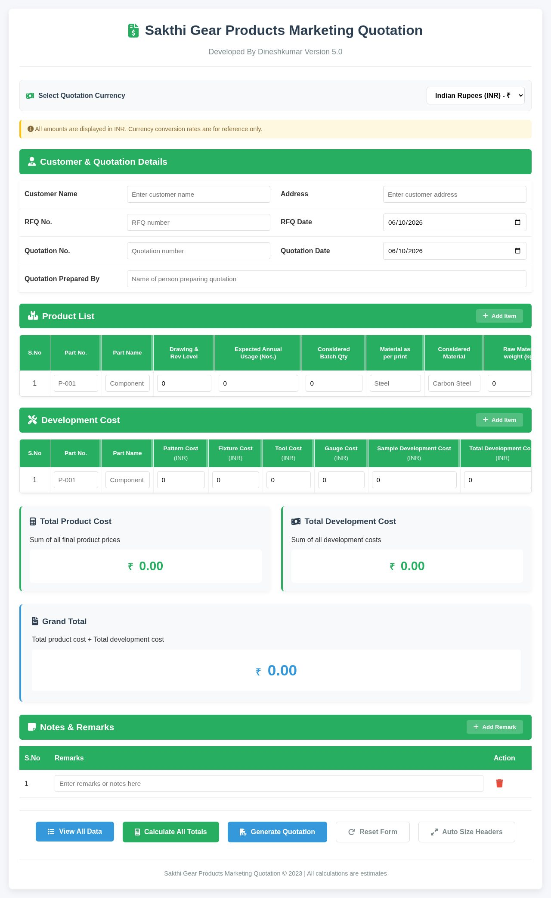

# SGP-ERP

An ERP (Enterprise Resource Planning) system for manufacturing, built with Node.js and MongoDB.

## Overview

SGP-ERP is a lightweight ERP system designed for small-to-medium manufacturing businesses. It handles machining parameters, cycle time calculation, quotation generation, and client management.

## Features

- **Machining parameters** management
- **Cycle time** calculation
- **Quotation** generation
- **Client** management
- **Docker** deployment ready

## Tech Stack

- **Runtime:** Node.js 18
- **Database:** MongoDB (Mongoose ODM)
- **Deployment:** Docker, Docker Compose

## Quick Start

### With Docker

```bash
docker-compose up --build
```

### Manual

```bash
npm install
npm start
```

## Screenshots






## Environment Variables

Create a `.env` file:

```env
PORT=8080
MONGODB_URI=mongodb://localhost:27017/sgp-erp
```

## Project Structure

```
├── Dockerfile
├── docker-compose.yml
├── package.json
├── public/              # Static HTML pages
│   ├── index.html
│   ├── machining-params.html
│   ├── cycle-time.html
│   └── quotation.html
└── src/                 # Application source
```

## License

MIT